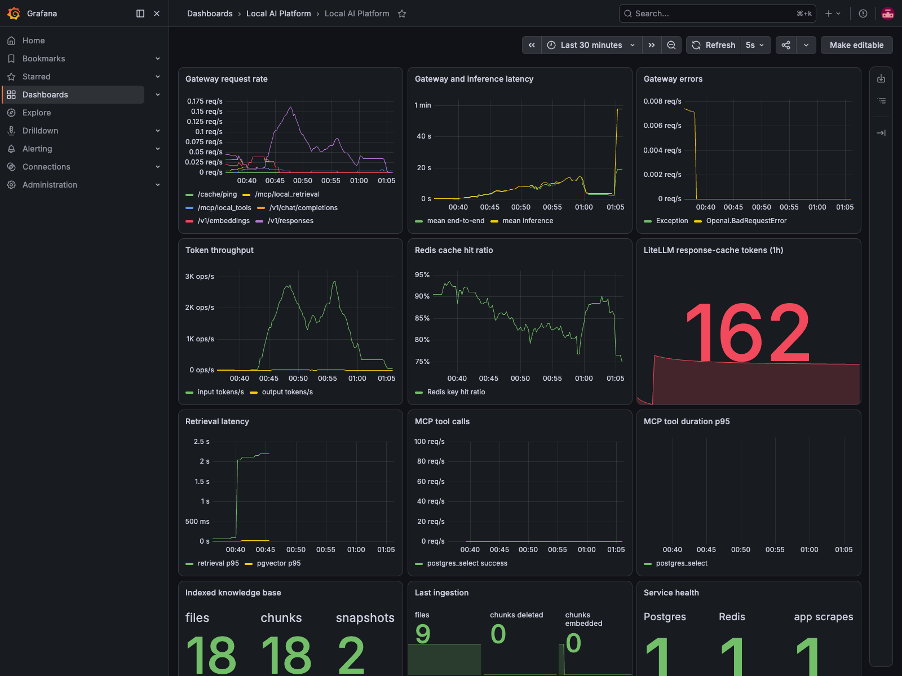

# Local AI Platform

An open-source, reproducible local AI platform for coding agents on Apple Silicon, powered by Qwen, LiteLLM, Docker Model Runner, Codex, Hermes, MCP, Redis, PostgreSQL/pgvector, and Grafana.

> Status: validated Apple Silicon MVP. Core gateway, model, cache, retrieval,
> offline MCP, and observability paths passed live tests on a 48 GiB arm64 Mac.
> The autonomous local-model coding exercise did not pass its acceptance
> criteria; that limitation is documented instead of being hidden.

## Why this exists

A coding agent is more than a local chat UI. It needs a model gateway, tool permissions, retrieval, caching, auditability, and a safe execution boundary. This repository puts those pieces behind one OpenAI-compatible endpoint:

```text
Codex / Hermes / other clients -> LiteLLM -> local Qwen on Apple Silicon
                                      |
                                      +-> Redis response cache
                                      +-> MCP Gateway
                                      +-> PostgreSQL + pgvector retrieval
                                      +-> Prometheus / Loki / Grafana
```

## Quick start target

Requirements: an Apple Silicon Mac and Docker Desktop 4.40 or newer with at least 32 GiB unified memory. The default 30B coding model is approximately 16.5 GB before runtime and KV-cache overhead; 48 GiB is recommended for a useful coding context.

```sh
git clone https://github.com/taras-kolodchyn/local-ai-platform.git
cd local-ai-platform
make up
```

`make up` diagnoses the host, creates a local `.env`, enables Docker Model Runner, pulls pinned Qwen model artifacts, starts the container services, waits for health checks, verifies the gateway and cache, and writes client configuration examples under `.local/`.

Use the native Codex sidebar in VS Code while keeping the generated provider,
credentials, sessions, and MCP configuration isolated from your normal
`~/.codex`:

```sh
make vscode-install
make vscode-check
make vscode-smoke
make vscode
```

The install target is a one-time connected step. Daily use is `make up` followed
by `make vscode`. Open **Codex: Open Codex Sidebar** from the Command Palette and
keep execution on **Local**. See the [VS Code workflow](docs/vscode.md) for the
security boundary and troubleshooting.

The terminal client remains available with the same generated configuration:

```sh
source .local/client.env
CODEX_HOME="$PWD/.local/codex" codex
```

The generated Codex configuration uses LiteLLM's Responses API bridge and reaches only the allowlisted, read-only MCP tools through the LiteLLM MCP Gateway. The repository `AGENTS.md` keeps retrieved text in the untrusted-data boundary.

Useful commands:

```sh
make help
make doctor
make status
make logs
make vscode
make vscode-check
make vscode-smoke
make smoke-test
make index REPO=/absolute/path/to/repository
make hermes-smoke
make connected-up
make down
```

## Endpoints

All host-facing services bind to loopback by default.

| Service | URL |
| --- | --- |
| LiteLLM API | `http://127.0.0.1:4000/v1` |
| LiteLLM UI | `http://127.0.0.1:4000/ui` |
| Retrieval API | `http://127.0.0.1:8000` |
| Offline MCP tools | `http://127.0.0.1:8001/mcp/` |
| Grafana | `http://127.0.0.1:3000` |
| Prometheus | `http://127.0.0.1:9090` |

Client-facing aliases are `local-qwen` and `local-embeddings`. The Docker Model Runner artifact names are internal implementation details.

## macOS inference boundary

Docker Model Runner uses llama.cpp with automatic Metal acceleration on Apple Silicon. On macOS, its inference engine does not run in a normal Linux container; Docker Desktop runs it in a host sandbox and exposes an API to containers. See [ADR 0001](docs/adr/0001-inference-runtime.md) for the decision and fallback design.

## Documentation

- [Architecture](docs/architecture.md)
- [Verified capability matrix](docs/capability-matrix.md)
- [Implementation plan](docs/implementation-plan.md)
- [Inference runtime ADR](docs/adr/0001-inference-runtime.md)
- [Threat model and security design](docs/security.md)
- [Risk register](docs/risks.md)
- [Offline operation](docs/offline.md)
- [Native VS Code workflow](docs/vscode.md)
- [Opt-in connected mode](docs/connected.md)
- [Troubleshooting](docs/troubleshooting.md)
- [Benchmark method](docs/benchmarking.md)
- [Measured results and agent validation](docs/results/agent-validation-2026-07-19.md)
- [Ukrainian DOU article draft](docs/dou-article.md)



## Security posture

The default profile is offline and localhost-only. MCP tools are allowlisted, external credentials are absent, request bodies are not shipped to a remote telemetry service, and the Docker socket is not mounted. Local does not mean automatically safe: code, documentation, models, containers, MCP servers, and generated shell commands remain part of the attack surface.

See [SECURITY.md](SECURITY.md) for reporting vulnerabilities.

## License

Apache-2.0. See [LICENSE](LICENSE).
