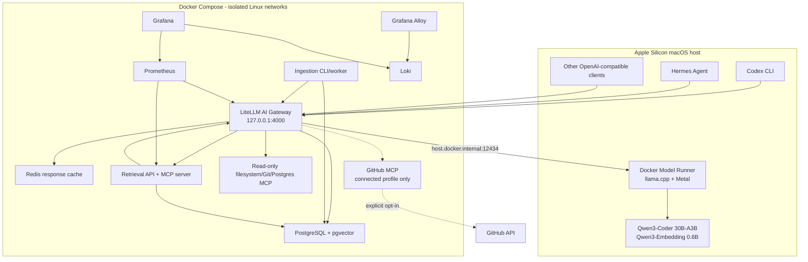
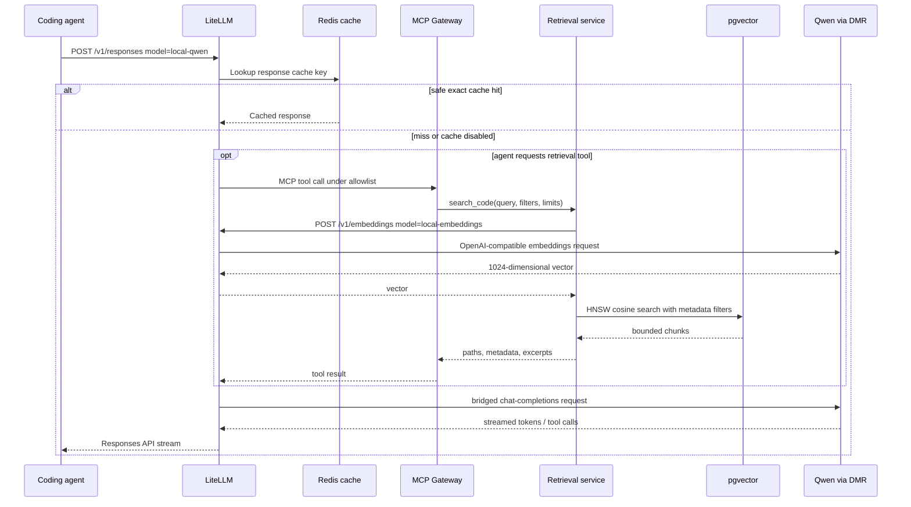
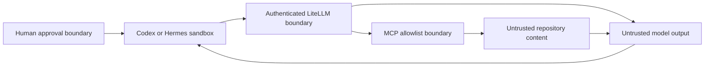

# Architecture

Status: accepted for MVP
Last verified: 2026-07-19

## Goals and boundaries

The platform gives local coding agents a stable OpenAI-compatible endpoint while keeping the inference runtime, caching, retrieval, tool access, and observability replaceable. The MVP targets Apple Silicon and defaults to no internet-dependent tools after model artifacts and container images have been pulled.

The platform does not grant a Linux container direct Metal access. Docker Model Runner executes llama.cpp through Docker Desktop's macOS host integration and exposes it to the Compose network.

## Component view

## Request path

## Retrieval pipeline

```mermaid
flowchart LR
    Repo["Git repository or docs"] --> Scan["Scanner\n.gitignore + allowlist"]
    Scan --> Guard["Secret/generated-file exclusions"]
    Guard --> Chunk["Deterministic chunker"]
    Chunk --> Hash["Content + metadata hash"]
    Hash --> Embed["local-embeddings alias"]
    Embed --> Store["pgvector + metadata"]
    Store --> Search["HNSW cosine search"]
    Search --> Limit["Top-k + total-character budget"]
    Limit --> MCP["read-only retrieval MCP tool"]
```

Each chunk records repository, relative path, branch, commit, language, optional symbol, content hash, chunk ordinal, and ingestion timestamp. Reindexing upserts changed chunks and removes rows no longer present at the same repository/branch snapshot.

## Trust boundaries

Repository text and retrieved chunks are data, even when they contain phrases that look like instructions. Shell and write actions remain subject to the client sandbox and approval policy. The gateway does not make model-generated commands safe.

## Network layout

- `gateway`: LiteLLM, Redis, retrieval, ingestion, exporters, and the optional connected GitHub MCP service.
- `data`: PostgreSQL, LiteLLM, retrieval, ingestion, and PostgreSQL exporter; this network is internal.
- `observability`: LiteLLM, retrieval, Prometheus, Loki, Alloy, and Grafana.
- `mcp-host`: a non-internal bridge used only by the offline MCP service so
  Docker Desktop can publish its loopback host port; data access still crosses
  the isolated `data` network.
- `observability-host`: a non-internal bridge for Prometheus and Grafana
  loopback publication. Docker Desktop does not publish ports from containers
  attached only to `internal: true` networks.
- Host ports bind to `127.0.0.1` only.
- No service mounts `/var/run/docker.sock`.
- The connected profile is separate and is not enabled by `make up`.

## Cache taxonomy

| Mechanism | Owner | What it stores | MVP status |
| --- | --- | --- | --- |
| Response cache | LiteLLM + Redis | Exact full LLM responses | Implemented with short TTL and per-request bypass |
| Semantic response cache | Optional LiteLLM backend | Similar prompt responses | Deferred; risky for stateful agent turns |
| KV/prompt cache | Inference runtime | Attention state for model prefixes | Runtime concern; not Redis |
| Embedding reuse | Ingestion/pgvector | Reuse stored vectors when the path/chunk content hash is unchanged | Implemented; not a separate Redis cache |
| Knowledge base | PostgreSQL + pgvector | Versioned source chunks and metadata | MVP |

## Responses tool-result detail

The verified Codex-compatible round trip sends the first tool result to
LiteLLM with `previous_response_id` and a `function_call_output` item only.
Replaying the original `function_call` alongside its output made the local
Qwen/llama.cpp message template reject the request. The smoke test locks in the
working sequence.

## Extensibility

Clients only know `local-qwen`, `local-embeddings`, and LiteLLM. A future Ollama or MLX-LM backend can replace DMR by changing the gateway configuration. LiteLLM 1.93.0 also has an A2A Agent Gateway; it is deliberately deferred until an end-to-end local A2A agent is tested and protocol version 1.0 is pinned.
